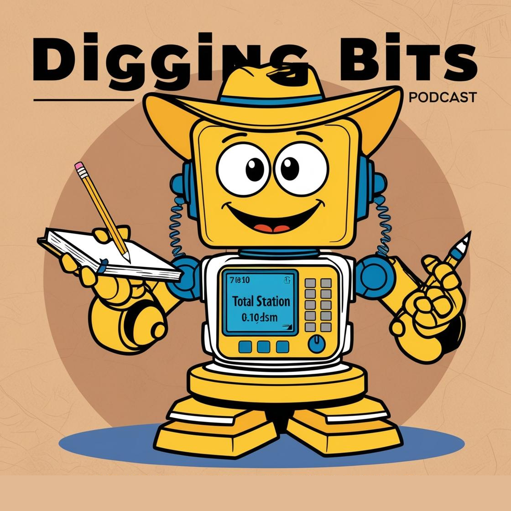

    preview do podcast

    <audio src="output/Escavando_Bits-Fotogrametria.MP3" controls title="Podcast"></audio>

# Projeto Podcast Gerado por I.A.s

 > ℹ️ **NOTE:** Este é o repositório desenvolvido durante o curso de IA Generativa com Microsoft Copilot (DIO e CAIXA). Instrutor Felipe Aguiar

Este projeto teve o objetivo de gerar um podcast sobre tecnologias utilizadas na Arqueologia. Para tanto, foram  usadas ferramentas de IA através de prompts mais trabalhados.

## 💻 Tecnologias utilizadas no projeto

- [ChatGPT](https://chat.openai.com/) 
- [Canva](https://www.canva.com/)
- [ElevenLabs](https://beta.elevenlabs.io/)
- [Capcut](https://www.capcut.com/pt-br/)

## ✨ Como foi feito ?

- Roteiro gerado via chatgpt
- Audio gerado pela ElevenLabs
- Canva para gerar capas
- Capcut para tratar aúdio e adicionar sons de fundo

---